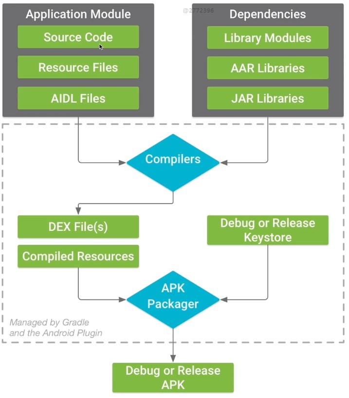
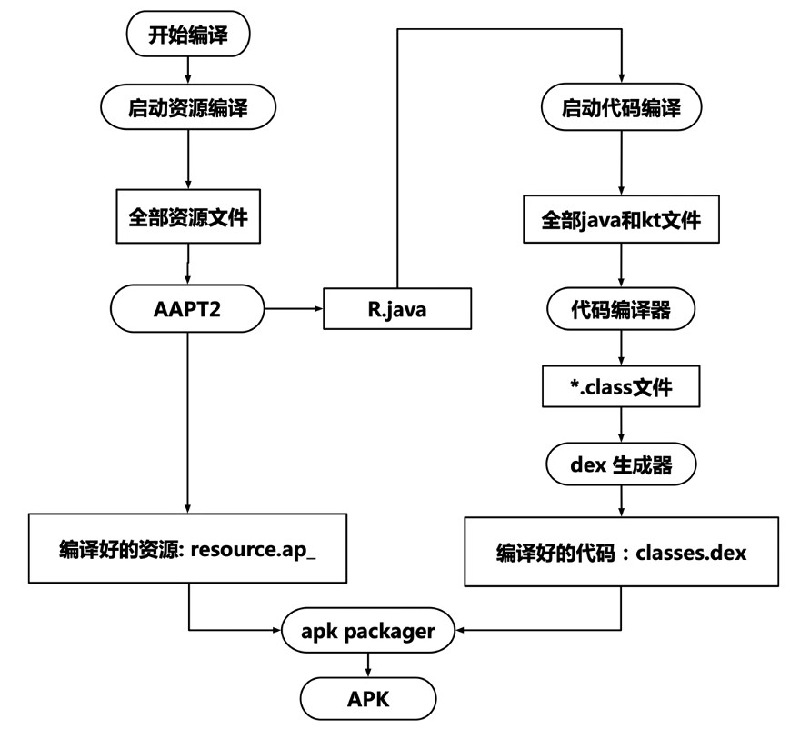

# Android 应用构建原理

[toc]

## 1. 概述

- 安装包结构解析
- 构建原理解析
- 构建原理与热修复的结合

## 2. 安装包结构解析

- lib/：该目录通常用来存放so文件。通常情况下只需要考虑arm和x86即可。其中x86用于模拟器，arm架构用于真实手机用户。
- res/：资源目录。
- resources.arsc：编译好的二进制资源文件。
- assets：也是应用程序资源的一种，在运行的时候通过AssetManager检索使用。
- META-INF/：一般用于存放已经签名的apk的文件的摘要信息。
- classes(N).dex：将Java代码编译成class文件之后，再进一步被dex程序编译成Android 虚拟机所识别的文件格式。
- AndroidManifest.xml：配置清单文件

## 3. 构建原理解析

### 3.1 构建流程

### 3.2 资源编译

AAPT2：Android Asset Packaging Tool。包括编译阶段和链接阶段。