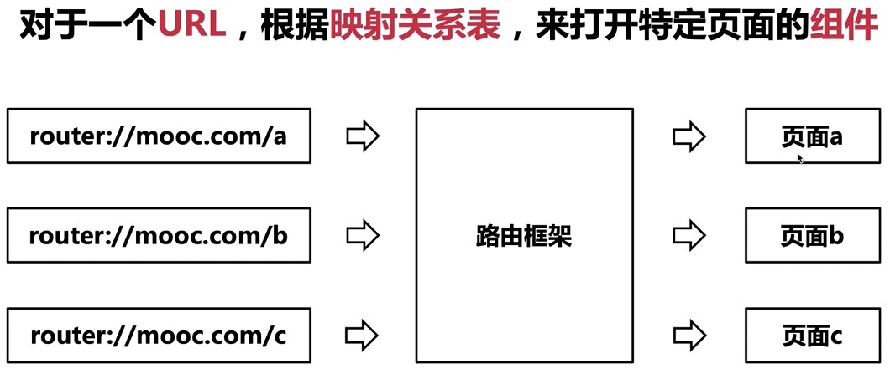
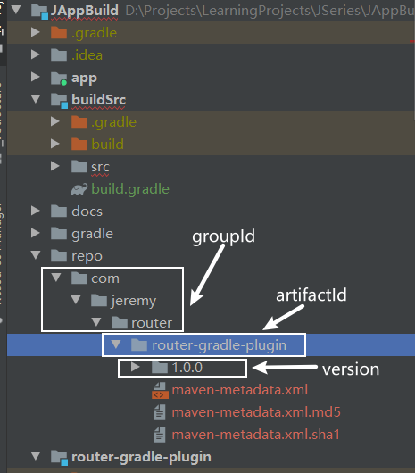
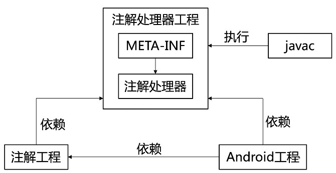

# Gradle插件开发

[toc]

## 1. Gradle插件介绍

Gradle是一个构建工具，负责让工程构建变得更自动化，不过它只是一个执行环境，提供基本框架，而真正的构建行为不是由gradle自身提供，gradle在运行的时候找到所有的任务依次执行。

Gradle插件负责提供具体的构建功能（Task）；

提高代码的复用性

## 2. Gradle插件使用

### 2.1 二进制插件

第一步，声明插件ID与版本号，例如，

```groovy
buildscript {
    repositories {
        google()
        jcenter()
    }
    dependencies {
        // 声明插件ID与版本号
        classpath "com.android.tools.build:gradle:4.1.1"

        // NOTE: Do not place your application dependencies here; they belong
        // in the individual module build.gradle files
    }
}
```

第二步、应用插件

```
// 应用插件
plugins {
    id 'com.android.application'
}
```

第三步、配置插件

```
android {
    compileSdkVersion 30
    buildToolsVersion "30.0.3"

    defaultConfig {
        applicationId "com.jeremy.jappbuild"
        minSdkVersion 19
        targetSdkVersion 30
        versionCode 1
        versionName "1.0"

        testInstrumentationRunner "androidx.test.runner.AndroidJUnitRunner"
    }

    buildTypes {
        release {
            minifyEnabled false
            proguardFiles getDefaultProguardFile('proguard-android-optimize.txt'), 'proguard-rules.pro'
        }
    }
    compileOptions {
        sourceCompatibility JavaVersion.VERSION_1_8
        targetCompatibility JavaVersion.VERSION_1_8
    }
}
```

### 2.2 脚本插件

第一步，首先创建脚本插件，例如在项目根目录创建other.gradle，在该文件中编写指定的逻辑；

第二步，在需要使用该脚本插件的module中，应用该脚本插件

```
apply from: project.rootProject.file("other.gradle")
```


## 3. 实战开发一个Gradle插件

Android Gradle插件是基于java插件去进行开发的。

### 3.1 二进制插件开发流程

- 建立插件工程
- 实现插件内部逻辑
- 发布与使用插件

### 3.2 页面路由框架



#### 3.2.1 页面路由插件功能梳理

- 标记页面
- 收集页面
- 生成文档
- 注册映射
- 打开页面

### 3.3 插件工程建立

二进制插件开发的形式有两种

#### 3.3.1 普通工程形式

实现成为一个普通的工程。这种工程如果在开发的过程中，如果我们需要调试，需要手动发布一个二进制插件jar包，这样在其他工程中去引用发布好的插件，进行功能的测试，这样的过程是相当麻烦的。可以通过buildSrc子工程解决该问题。

#### 3.3.2 buildSrc子工程形式

- **建立buildSrc子工程**

  如果我们把插件的逻辑写在里面，在构建的时候gradle就会自动的打包成为一个二进制插件jar包。对于开发过程中，这种形式是更为方便的。

  - 在根工程中创建目录，目录名为buildSrc（必须是此名称）；

  - 在buildSrc目录下创建build.gradle文件

    ```groovy
    // 引入groovy插件，编译插件工程中的代码
    apply plugin: 'groovy'
    
    // 声明将会使用到的第三方包所属的仓库，这样gradle才会知道去哪里下载第三方包
    repositories {
    //    google()
        jcenter()
    }
    
    // 指定需要用到哪些第三方包来辅助插件开发
    dependencies {
        // 插件是基于gradle的，所以需要用到gradle这个包
        implementation gradleApi()
        // groovy的基础功能
        implementation localGroovy()
    }
    ```

- **建立插件运行入口**

  - 在buildSrc工程中的src/main下创建groovy目录，在groovy目录下创建包，例如com.jeremy.router.gradle，新建类实现Plugin。

    ```groovy
    package com.jeremy.router.gradle
    
    import org.gradle.api.Plugin
    import org.gradle.api.Project
    
    class RouterPlugin implements Plugin<Project> {
    
        // 当我们采用apply去引用我们的插件时，apply方法将被执行。因此我们可以在apply方法里面注入插件的逻辑
        @Override
        void apply(Project project) {
            println("I am from RouterPlugin,apply from ${project.name}")
        }
    }
    ```

  - 在buildSrc工程中的src/main下创建**resources**目录，然后在该目录下创建目录

    **META-INF.gradle-plugins**目录，并在该路径下创建文件**pluginname.properties**文件。例如本例中的com.jeremy.router.properties。并在文件中申明该插件的class文件。

    ```groovy
    # com.jeremy.router即为插件的名称
    # implementation-class表明com.jeremy.router这个插件需要用到的Plugin类
    implementation-class=com.jeremy.router.gradle.RouterPlugin
    ```

### 3.4 插件参数配置

- 定义Extension

```groovy
package com.jeremy.router.gradle

class RouterExtension {
    String wikiDir;
}
```

- 注册Extension

```groovy
 // 注册Extension
 project.getExtensions().create("router", RouterExtension)
```

- 使用Extension

```groovy
router {
    wikiDir getRootDir().absolutePath
}
```

- 获取Extension

```
// 在gradle里面，首先是初始化阶段，然后是配置阶段。在配置阶段，才会把gradle脚本，也就是build.gradle
// 的所有配置代码集成一遍，插件只有在gradle的配置阶段结束以后才能拿到相关的配置。
// 当执行到afterEvaluate这个方法时，就意味着当前工程的配置阶段已经结束了。
RouterExtension extension1 = project["router"]
println("wikiDir path: " + extension1.wikiDir) // wikiDir path: null

project.afterEvaluate {
    RouterExtension extension = project["router"]
    println("wikiDir path: " + extension.wikiDir) // wikiDir path: D:\Projects\LearningProjects\JSeries\JAppBuild
}
```

### 3.4 发布与使用插件

#### 3.4.1 发布到本地仓库

- 定义发布任务

  在buildSrc目录下的build.gradle文件中声明如下代码，用作将插件发布

  ```
  // 1. 调用maven插件，用于发布
  apply plugin: 'maven'
  
  // 2. 配置来自maven插件上的task
  uploadArchives {
      repositories {
          mavenDeployer {
              // 设置发布路径为工程根目录下面的repo文件夹
              repository(url: uri('../repo')) {
                  // 设置groupId,通常为包名
                  pom.groupId = 'com.jeremy.router'
                  // 设置artifactId，为当前插件的名称
                  pom.artifactId = 'router-gradle-plugin'
                  // 设置插件的版本号
                  pom.version = '1.0.0'
              }
          }
      }
  }
  ```

- 复制buildSrc工程，并重命名为插件名称router-gradle-plugin，并在setting.gradle当中申明

  ```groovy
  include ':router-gradle-plugin'
  ```

- 执行任务uploadArchives任务，即可在本地仓库中看到已经发布的插件了。

  

#### 3.4.2 在工程中应用插件

- 在工程的根目录的build.gradle中申明

  ```groovy
  // Top-level build file where you can add configuration options common to all sub-projects/modules.
  buildscript {
      repositories {
          google()
          jcenter()
          // 1. 配置maven仓库地址
          maven {
              url uri("D:\\Projects\\LearningProjects\\JSeries\\JAppBuild\\repo")
          }
      }
      dependencies {
          classpath "com.android.tools.build:gradle:4.1.1"
  
          // NOTE: Do not place your application dependencies here; they belong
          // in the individual module build.gradle files
          // 2. 声明依赖的插件，形式为groupId:artifactId:version
          classpath "com.jeremy.router:router-gradle-plugin:1.0.0"
      }
  }
  
  allprojects {
      repositories {
          google()
          jcenter()
          // 1. 配置maven仓库地址
          maven {
              url uri("D:\\Projects\\LearningProjects\\JSeries\\JAppBuild\\repo")
          }
      }
  }
  
  task clean(type: Delete) {
      delete rootProject.buildDir
  }
  ```

- 在需要使用该插件的module的build.gradle中引用该插件，并申明该插件需要的配置

  ```groovy
  plugins {
      id 'com.android.application'
      // 3. 应用路由插件
      id 'com.jeremy.router'
  }
  
  // 4. 向路由插件传递参数
  router {
      wikiDir getRootDir().absolutePath
  }
  ```

## 4. APT采集页面路由信息

### 4.1 APT是什么

认识APT的概念以及使用场景

- **注解（Annotation）**

  注解分为标准注解和元注解。标准注解有4种，@Override，@Deprecated，@SuppressWarnings，@SafeVarags。

  元注解是用来标注其他注解，从而创建新的注解

- **注解处理器（Annotation Processing Tool）**

  针对运行时注解会采用反射机制处理，针对编译时注解会采用AbstractProcessor来处理。

### 4.2 APT的技术原理

了解APT的开发流程以及内部技术原理



注解工程：定义注解

注解处理器工程：主要由两个比较重要的部分组成。

- META-INF里面存在一个配置文件：该配置文件会有一个入口，指向注解处理器；
- 注解处理器：接收javac找出的所有注解，完成相应的注解处理逻辑。

开发流程：

- 定义注解
- 编写注解处理器
- 调用注解与注解处理器

### 4.3 APT实战应用

路由信息采集功能的介绍与梳理陆游信息采集功能的实现

- 标记页面
- 收集页面
- 生成文档
- 注册映射
- 打开页面

#### 4.3.1 定义注解

建立注解工程，router-annotations，在src的java目录下，定义注解

```java
package com.jeremy.router.annotations;

import java.lang.annotation.ElementType;
import java.lang.annotation.Retention;
import java.lang.annotation.RetentionPolicy;
import java.lang.annotation.Target;

@Target(ElementType.TYPE) // 说明当前注解可以修饰的元素，此处表示可以用于标记在类上面
@Retention(RetentionPolicy.CLASS) // 说明当前注解能被保留的时间
public @interface Destination {
    // 当前页面的URL,不能为空
    String url();

    /**
     * 对当前页面的中文描述
     * @return 例如 “个人主页”
     */
    String description();
}

```

#### 4.3.2 实现DestinationProcessor

- 建立注解处理器工程router-processor，在该工程的java路径下定义注解处理器DestinationProcessor

  ```java
  package com.jeremy.router.processor;
  
  import com.google.auto.service.AutoService;
  import com.jeremy.router.annotations.Destination;
  
  import java.io.IOException;
  import java.io.Writer;
  import java.util.Collections;
  import java.util.Set;
  
  import javax.annotation.processing.AbstractProcessor;
  import javax.annotation.processing.Processor;
  import javax.annotation.processing.RoundEnvironment;
  import javax.lang.model.element.Element;
  import javax.lang.model.element.TypeElement;
  import javax.tools.JavaFileObject;
  
  @AutoService(Processor.class)
  public class DestinationProcessor extends AbstractProcessor {
      private static final String TAG = "DestinationProcessor";
  
      /**
       * 编译器找到我们关心的注解后，会回调该方法
       *
       * @param set
       * @param roundEnvironment
       * @return
       */
      @Override
      public boolean process(Set<? extends TypeElement> set, RoundEnvironment roundEnvironment) {
          // 如果已经处理过，直接返回,避免多次调用process
          if (roundEnvironment.processingOver()) {
              return false;
          }
  
          System.out.println(TAG + " >>> process start ...");
          // 从RoundEnvironment获取被Destination注解的元素
          Set<? extends Element> allDestinationElements = roundEnvironment.getElementsAnnotatedWith(Destination.class);
          System.out.println(TAG + " >>> all Destination elements count = " + allDestinationElements.size());
          if (allDestinationElements.size() < 1) { // 当未收集到@Destination注解的时候，跳过后续流程
              return false;
          }
  
          // 将要自动生成的类的类名
          String className = "RouterMapping_" + System.currentTimeMillis();
          StringBuilder builder = new StringBuilder();
          builder.append("package com.jeremy.jappbuild.mapping;\n\n")
                  .append("import java.util.HashMap;\n")
                  .append("import java.util.Map;\n\n")
                  .append("public class " + className + " {\n")
                  .append("    public static Map<String, String> get() {\n")
                  .append("        Map<String, String> mapping = new HashMap<>();\n");
  
          // 遍历所有 @Destination 注解信息，挨个获取详细信息
          for (Element element : allDestinationElements) {
              final TypeElement typeElement = (TypeElement) element;
              // 尝试在当前类上，获取@Destination的信息
              final Destination destination = typeElement.getAnnotation(Destination.class);
              if (destination == null) {
                  continue;
              }
              String url = destination.url();
              String description = destination.description();
              String realPath = typeElement.getQualifiedName().toString();
  
              builder.append("        mapping.put(\"")
                      .append(url)
                      .append("\", \"")
                      .append(realPath)
                      .append("\");\n");
  
              System.out.println(TAG + " >>> url = " + url + " >>> description = " + description + " >>> realPath = " + realPath);
          }
  
          builder.append("        return mapping;\n")
                  .append("    }\n")
                  .append("}");
  
          // 将builder字符串写入文件
          String mappingFullClassName = "com.jeremy.jappbuild.mapping." + className;
          System.out.println(TAG + " >>> mappingFullClassName = " + mappingFullClassName);
          System.out.println(TAG + " >>> class content = \n" + builder.toString());
          flushToFile(mappingFullClassName, builder.toString());
  
          System.out.println(TAG + " >>> process finish ...");
  
          return false;
      }
  
  
      private void flushToFile(String mappingFullClassName, String content) {
          try {
              JavaFileObject source = processingEnv.getFiler().createSourceFile(mappingFullClassName);
              Writer writer = source.openWriter();
              writer.write(content);
              writer.flush();
              writer.close();
          } catch (IOException e) {
              throw new RuntimeException("Error while create file ", e);
          }
      }
  
      // 告诉编译器当前处理器支持的注解类型
      @Override
      public Set<String> getSupportedAnnotationTypes() {
          return Collections.singleton(Destination.class.getCanonicalName());
      }
  }
  ```

- 采集注解

- 注册注解处理器

  在router-processor工程的build.gradle中申明auto-service相关的依赖，将DestinationProcessor注册到编译器，这样编译器才会将采集到的的相应注解传递给注解处理器

  ```groovy
  // 使用auto-service会将我们的注解处理器自动注册到编译器
  implementation 'com.google.auto.service:auto-service:1.0-rc6'
  annotationProcessor 'com.google.auto.service:auto-service:1.0-rc6'
  ```

  在注解处理器的类中，声明auto-service相关注解

  ```java
  @AutoService(Processor.class)
  public class DestinationProcessor extends AbstractProcessor {
  }
  ```

#### 4.3.3 发布与使用

- 发布

  定义maven发布脚本，maven-publish.gradle

  ```groovy
  // 使用maven插件中的发布功能
  apply plugin: 'maven'
  
  // 读取工程配置
  Properties gradleProperties = new Properties()
  gradleProperties.load(project.rootProject.file("gradle.properties").newDataInputStream())
  
  def POM_URL = gradleProperties.getProperty("POM_URL")
  def GROUP_ID = gradleProperties.getProperty("GROUP_ID")
  def VERSION_NAME = gradleProperties.getProperty("VERSION_NAME")
  
  Properties moduleProperties = new Properties();
  moduleProperties.load(project.file("gradle.properties").newDataInputStream())
  def POM_ARTIFACT_ID = moduleProperties.getProperty("POM_ARTIFACT_ID")
  
  println("POM_URL: " + POM_URL + "  " + "GROUP_ID: " + GROUP_ID + "  " + "POM_ARTIFACT_ID: " + POM_ARTIFACT_ID + "VERSION_NAME: " + VERSION_NAME)
  
  uploadArchives {
      repositories {
          mavenDeployer {
              // 设置发布路径为工程根目录下面的repo文件夹
              repository(url: uri('../repo')) {
                  // 设置groupId,通常为包名
                  pom.groupId = GROUP_ID
                  // 设置artifactId，为当前插件的名称
                  pom.artifactId = POM_ARTIFACT_ID
                  // 设置插件的版本号
                  pom.version = VERSION_NAME
              }
  
              pom.whenConfigured { pom ->
                  pom.dependencies.forEach {dep->
                      if (dep.getVersion() == "unspecified") {
                          dep.setGroupId(GROUP_ID)
                          dep.setVersion(VERSION_NAME)
                      }
                  }
              }
          }
      }
  }
  ```

  在需要发布的module的build.gradle中，应用maven-publish.gradle。然后执行对应module的uploadArchives任务，即可将仓库进行发布。

- 使用

  在需要使用该router路由处理框架的工程的根build.gradle文件中，声明maven仓库地址。如果是gradle插件，还需要在dependencies中声明classpath。

  ```groovy
  // Top-level build file where you can add configuration options common to all sub-projects/modules.
  buildscript {
      repositories {
          maven {
              url uri("D:\\Projects\\LearningProjects\\JSeries\\JAppBuild\\repo")
          }
          google()
          jcenter()
      }
      dependencies {
          classpath "com.android.tools.build:gradle:4.1.1"
          // 声明gradle插件ID与版本号
          classpath "com.jeremy.router:router-gradle-plugin:1.0.0"
          // NOTE: Do not place your application dependencies here; they belong
          // in the individual module build.gradle files
          // 对于router-annotations和router-processor，因为不是gradle插件，而是普通的aar，所以在这里不需要申明
      }
  }
  
  allprojects {
      repositories {
          maven {
              url uri("D:\\Projects\\LearningProjects\\JSeries\\JAppBuild\\repo")
          }
          google()
          jcenter()
      }
  }
  
  task clean(type: Delete) {
      delete rootProject.buildDir
  }
  ```

  在需要使用router路由框架的单个module中声明依赖

  ```groovy
  dependencies {
      // 依赖注解工程
  //    implementation project(":router-annotations")
      implementation 'com.jeremy.router:router-annotations:1.0.0'
  //     依赖注解处理器工程
  //    annotationProcessor project(":router-processor")
      annotationProcessor 'com.jeremy.router:router-processor:1.0.0'
  }
  ```

  当然，如果是gradle插件，还需要在单个module的build.gradle中应用插件

  ```
  // 应用插件
  plugins {
      id 'com.android.application'
      id 'com.jeremy.router' // 引用路由插件，亦可用apply plugin: 'com.jeremy.router'进行申明
  }
  ```

## 5. 为gradle插件添加文档生成功能

### 5.1 文档自动生成功能的梳理

#### 5.1.1 为什么需要这个功能

需要自动生成一个页面与对应url的映射表，以供开发人员进行查看。

#### 5.1.2 如何设计这个功能

- 传递路径参数
- 生成JSON文件
- 汇总生成文档

### 5.2 文档自动生成功能的代码实现